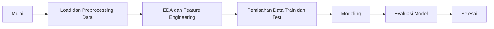

## 1. Project Machine Learning: Memprediksi Harga Mobil Toyota

### Identitas Lengkap
- **Nama:** Akhmad Haris
- **Nim:** A11.2022.14626
- **Matkul:** Pembelajaran Mesin 
- **Kelompok:** A11.4413

## 2. Ringkasan dan Permasalahan Project

### Ringkasan
Proyek ini bertujuan untuk memprediksi harga mobil Toyota berdasarkan beberapa fitur seperti tahun, jarak tempuh, pajak, mpg, dan ukuran mesin. Model ini diharapkan dapat memberikan estimasi harga mobil yang akurat sehingga dapat membantu dalam pengambilan keputusan untuk pembelian atau penjualan mobil.

### Permasalahan
Bagaimana cara memprediksi harga mobil dengan menggunakan dataset yang berisi informasi mengenai fitur-fitur mobil?

### Tujuan
- Membangun model machine learning untuk memprediksi harga mobil Toyota.
- Membandingkan performa model Linear Regression, Random Forest Regressor, dan Gradient Boosting Regressor.
- Melakukan tuning hyperparameter untuk meningkatkan performa model.

### Model / Alur Penyelesaian:

## 3. Penjelasan Dataset,EDA, dan Proses Features Dataset 

### Dataset
Dataset yang digunakan adalah dataset harga mobil Toyota yang berisi informasi tentang harga mobil dan beberapa fitur seperti tahun, jarak tempuh, pajak, mpg, ukuran mesin, dan model mobil.

### Eksplorasi Data Awal (EDA)
- Melihat distribusi data
- Menemukan pola atau korelasi antara fitur
- Mengidentifikasi nilai-nilai yang hilang dan outlier

### Proses Features Data
- Mengisi atau menghapus nilai yang hilang
- One-hot encoding untuk fitur kategorikal
- Scaling fitur numerik

## 4. Proses Learning / Modeling
Modeling dilakukan menggunakan beberapa algoritma machine learning seperti:
- Random Forest Regressor
- Gradient Boosting Regressor
Setiap model di-train menggunakan training set dan dievaluasi menggunakan test set. Hyperparameter tuning dilakukan untuk mendapatkan performa terbaik dari setiap model.

## 5. Performa Model
Model dievaluasi menggunakan metrik-metrik berikut:

- Mean Absolute Error (MAE)
- Mean Squared Error (MSE)
- R-squared (R²)
Hasil evaluasi digunakan untuk membandingkan performa model dan memilih model terbaik untuk prediksi harga mobil Toyota.

### Evaluasi Model
- Menggunakan metrik seperti MAE, MSE, dan R² untuk mengevaluasi performa model

## 6. Diskusi Hasil dan Kesimpulan

### Diskusi Hasil
- **Random Forest**: Model ini menunjukkan performa yang sangat baik dengan R² yang tinggi, menunjukkan kemampuan yang baik dalam menangani data yang kompleks.
- **Gradient Boosting**: Model ini juga memberikan performa yang baik, sedikit lebih baik dari Linear Regression namun masih di bawah Random Forest dalam hal akurasi prediksi.

### Kesimpulan
Berdasarkan hasil evaluasi, model Random Forest adalah yang terbaik untuk prediksi harga mobil bekas Toyota dalam dataset ini. Langkah selanjutnya bisa termasuk lebih banyak tuning hyperparameter untuk model Random Forest atau mencoba model-model lain yang lebih canggih untuk peningkatan akurasi lebih lanjut.
